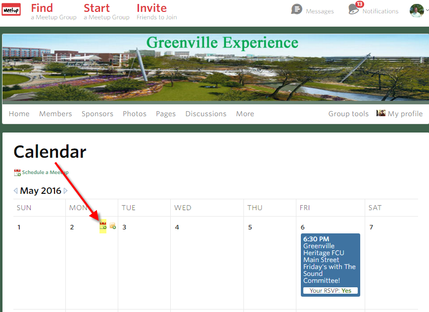
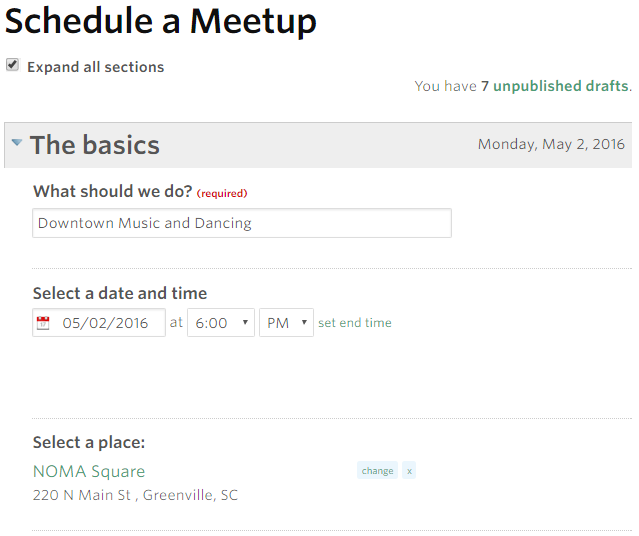
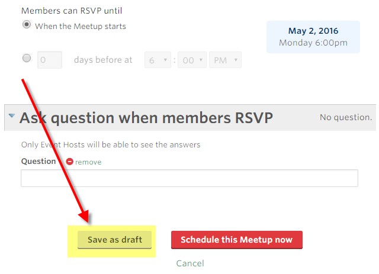
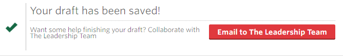

Create a Meetup Event as a Draft
================================

By `Jack Henderson`_

This document describes the steps required to create a Meetup.com event in draft mode.

.. contents:: In this article:
  :local:
  :depth: 1

Prerequisites
-------------

Link to meetup article `Scheduling a Meetup <http://help.meetup.com/customer/portal/articles/865540-schedule-a-meetup>`_ .

Create a meetup
---------------

To create an event as a draft, you must first go to the meetup calendar and click the icon for “add new” (see below). Don’t use “+ SCHEDULE A NEW MEETUP” link, it won’t allow saving as draft.
^^^^^^^^^^^^^^^^^^^^^^^^^^^^^^^^^^^^^^^^^^^^^^^^^^^^^^^^^^^^^^^^^^^^^^^^^^^^^^^^^^^^^^^^^^^^^^^^^^^^^^^^^^^^^^^^^^^^^^^^^^^^^^^^^^^^^^^^^^^^^^^^^^^^^^^^^^^^^^^^^^^^^^^^^^^^^^^^^^^^^^^^^^^^

Enter the details for the event.
^^^^^^^^^^^^^^^^^^^^^^^^^^^^^^^^

Scroll down to the bottom of the screen and click “Save as Draft”.
^^^^^^^^^^^^^^^^^^^^^^^^^^^^^^^^^^^^^^^^^^^^^^^^^^^^^^^^^^^^^^^^^

Your meetup is now saved in draft mode.
^^^^^^^^^^^^^^^^^^^^^^^^^^^^^^^^^^^^^^^

