Create Read the Docs Document
=============================

By `Jack Henderson`_

In this tutorial, you’ll create a simple Read the Docs document and post it to the web.

.. contents:: Sections:
  :local:
  :depth: 1

Prerequisites
-------------
Before you start, you will need a ReadTheDocs.org account: `Read the Docs <https://readthedocs.org/>`_ .

Step 1: Create Document
-----------------------
Write the document in Word using text and pictures.

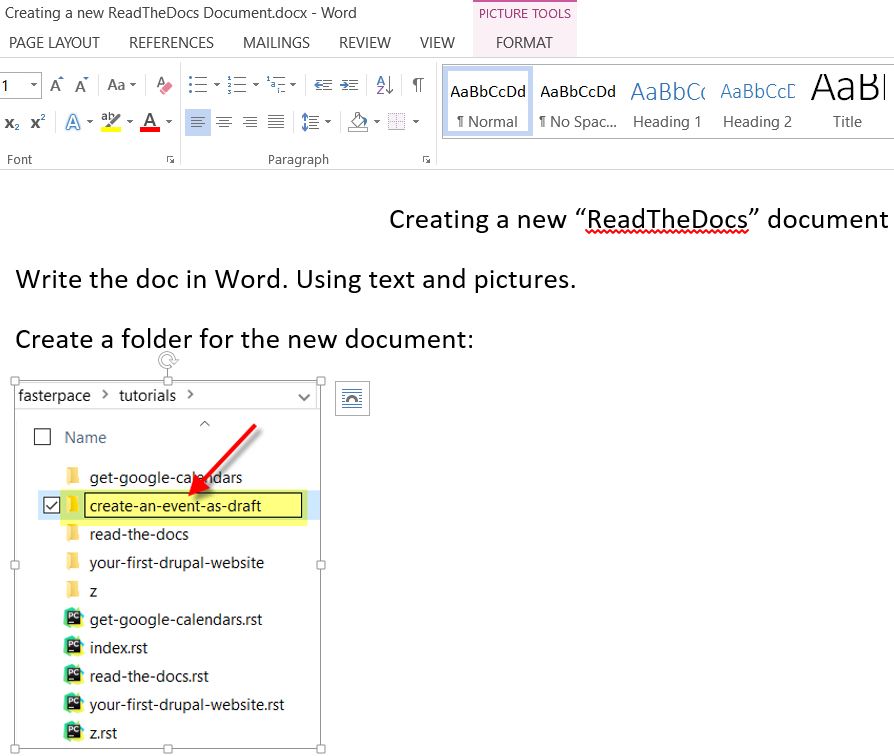

After creating your document. Add “.. image:: create-an-event-as-draft/_static/1.png” line above each picture. This is the relative file name that you will save the picture as. Increment the file name number for each consecutive picture.

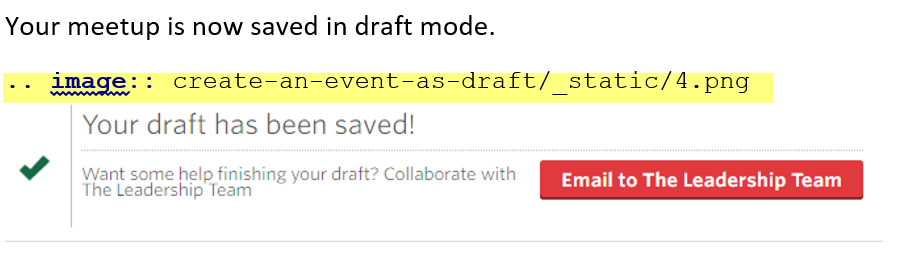

Create a folder for the new document:

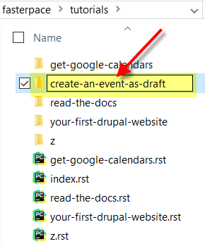

Create a folder under the newly create project folder named “_static”.

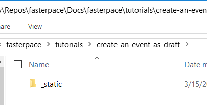

Create a flat file (text file) with the extension .rst. Use a text editor such as PyCharm.

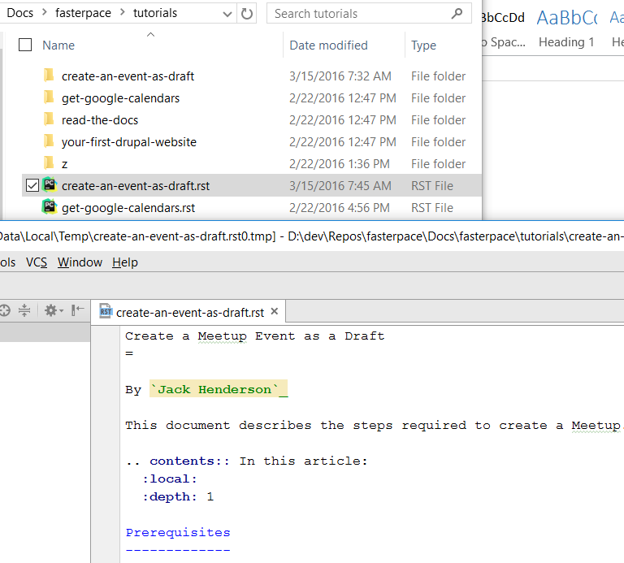

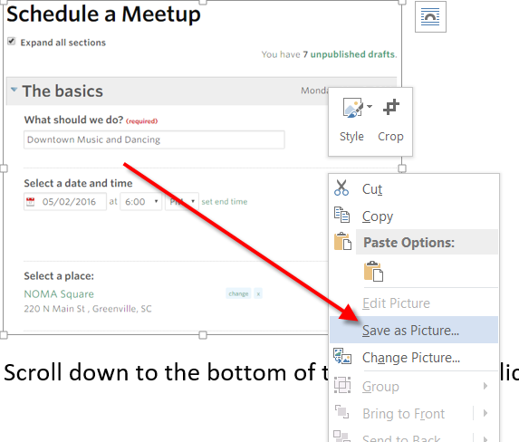

Name them (with incrementing number to be unique):
e.g. D:\dev\Repos\fasterpace\Docs\fasterpace\tutorials\create-an-event-as-draft\_static\1.png
Now that you have all the pictures saved and their names added just above each picture in the word document, you can copy that text (all of it) into the .rst file:
Edit the index file (D:\dev\Repos\fasterpace\Docs\fasterpace\tutorials\index.rst) and add the new project:

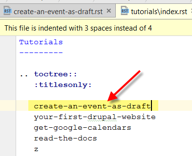

Build the project and verify it for accuracy.
Delete the _build folder (we don’t need it anymore).

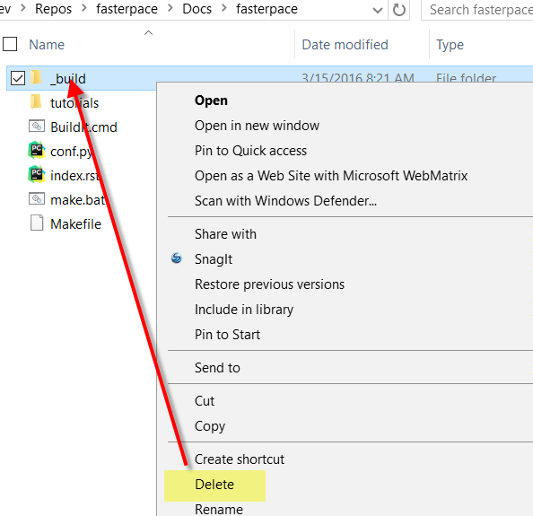

Launch Github desktop and add the new files to project.

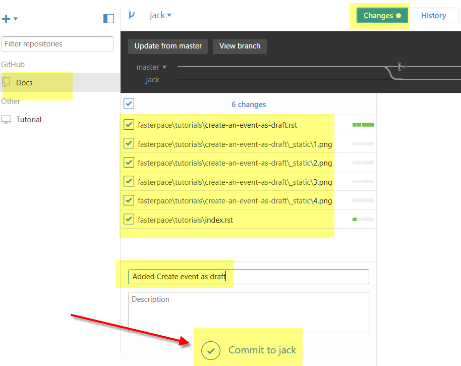

Request the Pull:

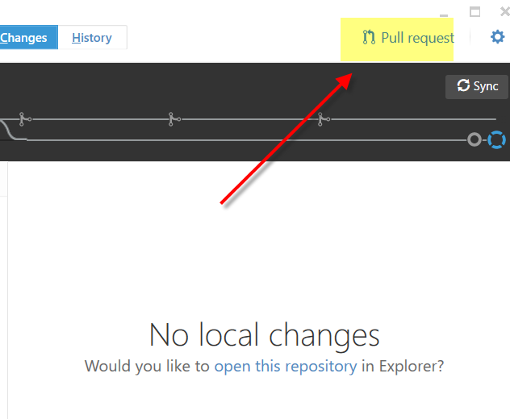

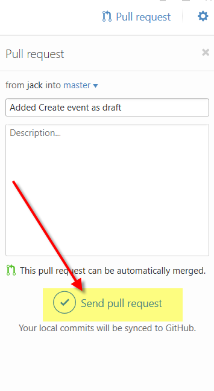

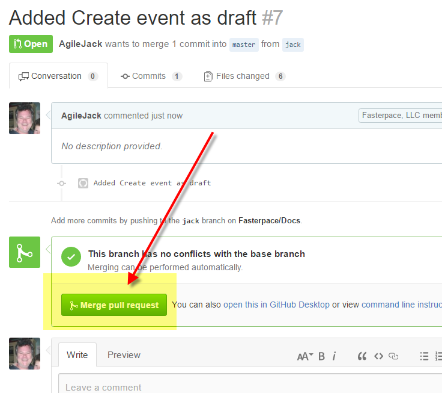

Now build it in “ReadTheDoc.org”:
https://readthedocs.org/projects/fasterpace-docs/
Click Build

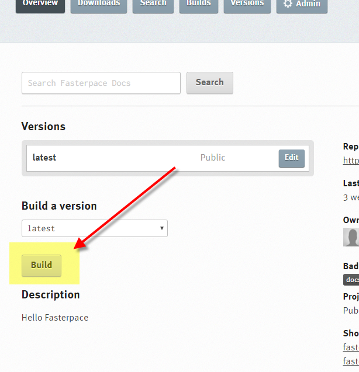

Click Build
Wait for long time ;)
Navigate to docs: http://fasterpace-docs.readthedocs.org/

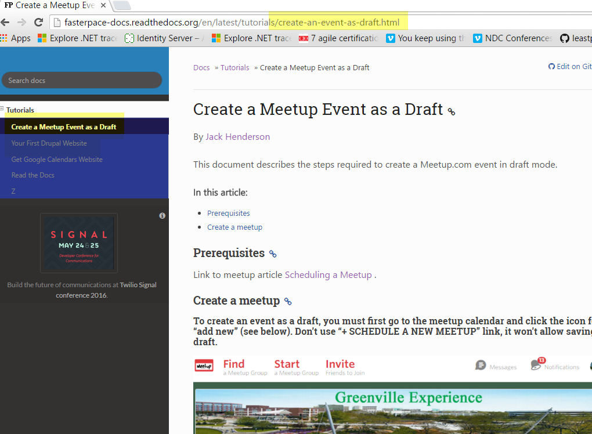

Done!
