Get Google Calendars Website
================================================

By `Jack Henderson`_

In this tutorial, you’ll create a website to Get Google Calendars.

.. contents:: In this article:
  :local:
  :depth: 1

Prerequisites
-------------
Before you start, make sure...

.. note:: For additional information...

Create MVC 6 Website
------------------------------

Start Visual Studio 2015 and select **File|New|Project**.

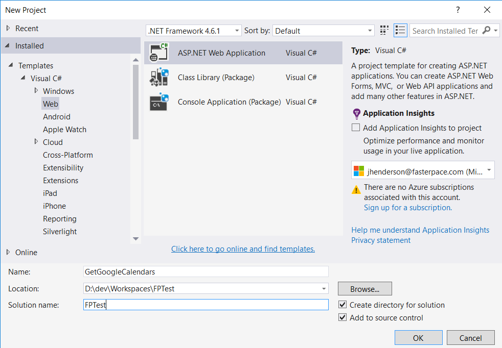
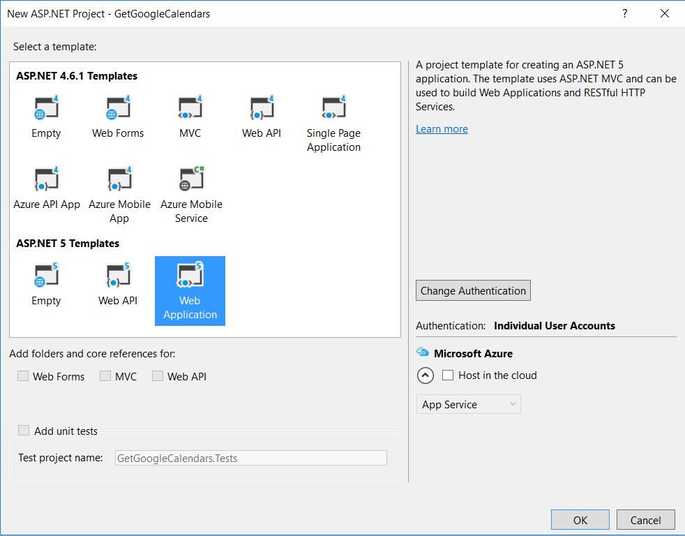
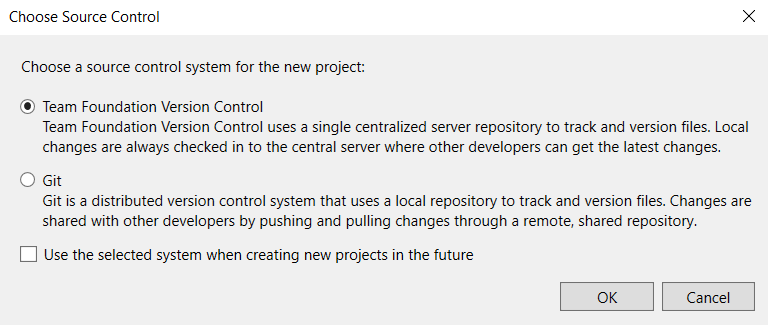

Entity Framework 7, ASP.NET 5, MVC 6 (google signin)
. Calendar Google to get Mema appointments and create a Travel log for Taxes.
1. Create web app http://docs.asp.net/en/latest/security/authentication/sociallogins.html
. for secrets: https://readthedocs.com/projects/aspnet-aspnet/downloads/pdf/latest/ search for secrets.json
. look for tutorial that gives config switching for dev/test/live settings

Add third party login

https://docs.asp.net/en/latest/security/authentication/sociallogins.html

Create Facebook app
^^^^^^^^^^^^^^^^^^^

google: create app FPTest with url https://localhost:44300/
Use whatever url port you can get!

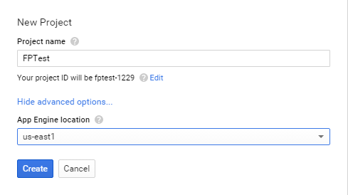

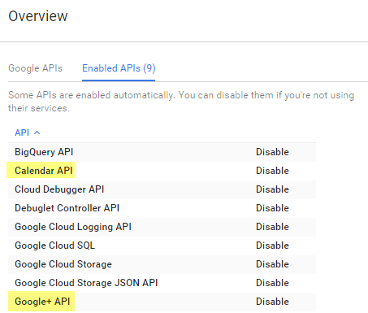

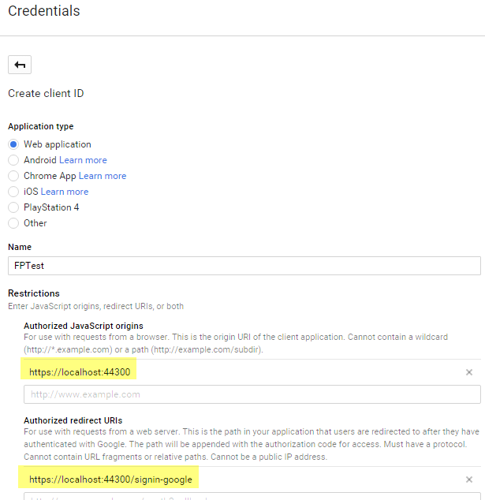

Facebook
https://developers.facebook.com/apps/

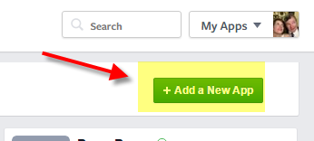

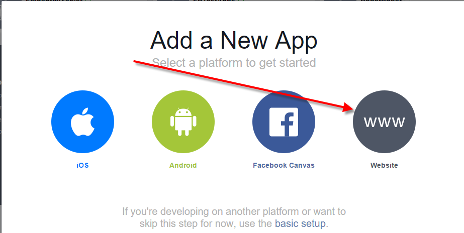

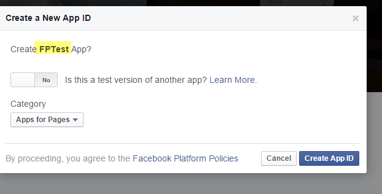

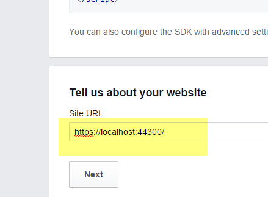

http://www.fasterpace.com/images/FPLogo2.jpgfb: create app FPTest with url https://localhost:44300/
Enable SSL with 44300 for url
http://localhost:44300/

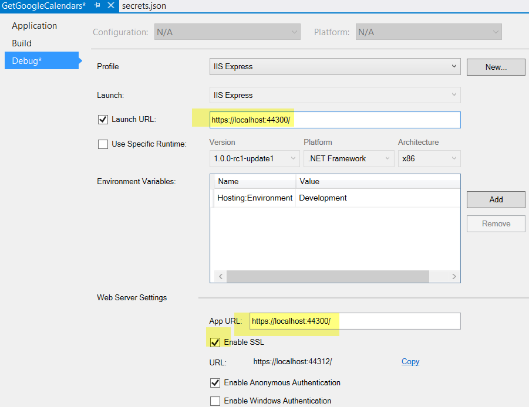

Add nugget package:
Microsoft.AspNet.Authentication.Facebook
Microsoft.AspNet.Authentication.Google

