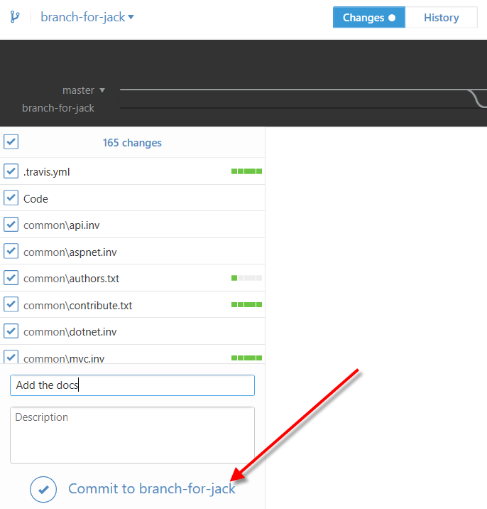
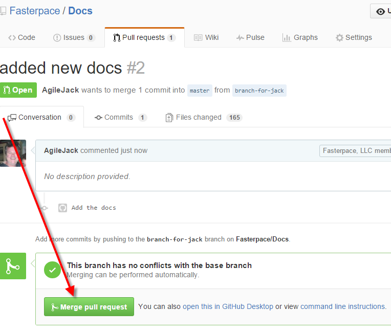

Read the Docs
================================================

By `Jack Henderson`_

In this tutorial...

.. contents:: In this article:
  :local:
  :depth: 1

Prerequisites
-------------
Before you start, make sure...

.. note:: For additional information...

Create the Docs and Add to Github
---------------------------------

signup for a github account `Github <https://github.com/>`_.

create new repository for Docs in github.

Clone Docs using Github desktop app

Create branch

Erase _build directory

Copy the new doc stuff we created earlier

commit

pull request

merge

Add the Project to Readthedocs
------------------------------

signup for a readthedocs.org account https://readthedocs.org
connect readthedocs to github account https://readthedocs.org/accounts/social/connections

.. image:: read-the-docs/_static/0260-.png

import doc into readthedocs.org

https://readthedocs.org/dashboard/ choose Import a project
http://docs.readthedocs.org/en/latest/getting_started.html
