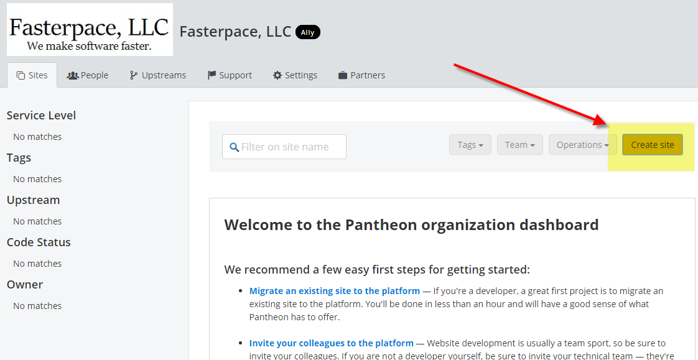

Your First Drupal Website
================================================

By `Jack Henderson`_

In this tutorial, you’ll create a drupal website hosted on Pantheon servers.

.. contents:: In this article:
  :local:
  :depth: 1

Prerequisites
-------------
Before you start, make sure that you have an account at `Pantheon <https://pantheon.io/>`_.

.. note:: For additional information about Drupal, see `Drupal <https://www.drupal.org/>`_.

Create a new Drupal Website
------------------------------

Navigate to `Pantheon <https://pantheon.io/>`_.

Select **Create New Site**.

Select a name for your site.

Navigate to: http://dev-oauth2me.pantheon.io/core/install.php
http://dev-oauth2me.pantheon.io/user/1

